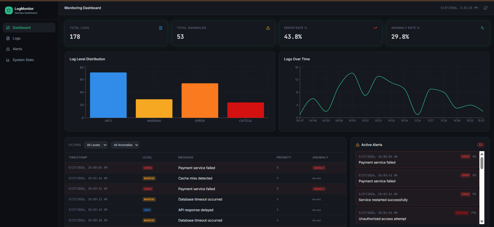

# AI Log Intelligence System

An AI-powered log monitoring and analysis platform that helps detect, analyze, and visualize system logs through an interactive dashboard.

## 🚀 Features

- Real-time log monitoring
- AI-powered log analysis
- Frontend dashboard for visualization
- Backend API integration
- Intelligent error detection
- Clean and responsive UI

## 🛠 Tech Stack

### Frontend
- React
- Vite
- TypeScript
- Tailwind CSS

### Backend
- Python
- FastAPI
- MYSql / Database

## 📂 Project Structure

```bash
ai-log-intelligence/
│
├── backend/
│   ├── main.py
│   ├── database.py
│   ├── models.py
│   └── schemas.py
│
├── log-watcher/
│   ├── src/
│   ├── public/
│   ├── package.json
│   └── ...
│
├── README.md
└── .gitignore
```

## ⚙️ Installation

### Clone repository

```bash
git clone https://github.com/Udhav05/ai-log-intelligence-system.git
cd ai-log-intelligence-system
```

### Backend setup

```bash
cd backend
pip install -r requirements.txt
python main.py
```

### Frontend setup

```bash
cd log-watcher
npm install
npm run dev
```

## 🎯 Future Improvements

- User authentication
- Advanced analytics dashboard
- Cloud deployment
- Notification system
- More AI insights

## 📸 Screenshots



## 👨‍💻 Author

Udhav

